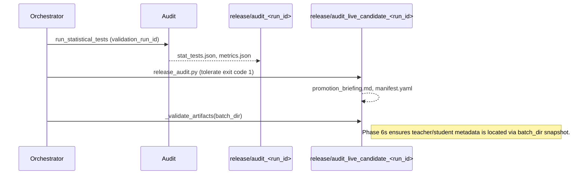

# SenseQuant Project Overview

> **Audience:** Engineering, Data Science, Product, and Operations stakeholders  
> **Document Type:** Development & User Documentation  
> **Last Updated:** 2025-10-14  
> **Maintainer:** SenseQuant Core Team (see `claude.md#Contacts`)

---

## 1. Executive Summary

SenseQuant is an end-to-end algorithmic trading platform focused on Indian equity markets (NSE/BSE).  
It combines a teacher–student learning architecture, multi-phase validation pipeline, and release governance to promote trading models from research to production with auditable quality gates.

**Key Capabilities**

- Historical data ingestion (chunked, rate-limited) with integrity checks.
- Teacher/Student dual-stage model training with reward/punishment roadmap.
- Statistical validation (walk-forward CV, bootstrap, hypothesis tests).
- Release audit & promotion briefing with policy checks.
- Roadmap for NIFTY100 + Metals expansion, reward loops, and black-swan stress tests.

---

## 2. Solution Architecture

```mermaid
flowchart TD
    subgraph Data["Data Sources"]
        A[Breeze OHLCV \n (Equities, ETFs)]
        B[Breeze Sentiment API]
        C[Stress Period Library \n (Roadmap)]
    end

    subgraph Pipeline["Historical Training Pipeline"]
        P1[Phase 1: Data Ingestion]
        P2[Phase 2: Teacher Training]
        P3[Phase 3: Student Training]
        P4[Phase 4: Model Validation]
        P5[Phase 5: Statistical Tests]
        P6[Phase 6: Release Audit]
        P7[Phase 7: Promotion Briefing]
    end

    subgraph Storage["Persistent Artifacts"]
        D1[data/historical/<symbol>/<interval>/]
        D2[data/models/<batch_id>/teacher_runs.json]
        D3[data/models/<batch_id>/student_runs.json]
        D4[release/audit_<run_id>/]
        D5[data/state/* (progress, checkpoints)]
    end

    Data --> P1
    P1 -->|OHLCV & Sentiment| D1
    D1 --> P2
    P2 -->|Teacher Artifacts| D2
    D2 --> P3
    P3 -->|Student Artifacts| D3
    P2 & P3 --> P4
    P4 -->|validation_run_id| P5
    P5 -->|stat_tests.json| P6
    P6 -->|Audit Bundle| P7
    P7 -->|Promotion Briefing| D4
    P1 & P2 & P3 -->|Progress Snapshots (Phase 7 roadmap)| D5
```

---

## 3. Filesystem & Artifact Layout

| Path | Description |
|------|-------------|
| `data/historical/<SYMBOL>/<INTERVAL>/<DATE>.csv` | Canonical OHLCV data (post-chunking) |
| `data/models/<BATCH_ID>/` | Teacher & student artifacts per window (Phase 6o+) |
| `data/state/` | StateManager checkpoints, progress snapshots (Phase 7 roadmap) |
| `release/audit_<RUN_ID>/` | Statistical validation bundle |
| `release/audit_live_candidate_<RUN_ID>/` | Release audit output + promotion briefing |
| `docs/stories/us-028-historical-run.md` | Phase-by-phase documentation (6a–6t) |
| `claude.md` | Operational guide, roadmap, current sprint notes |

---

## 4. Historical Training Pipeline (Phase 1–7 Detail)

| Phase | Description | Key Scripts | Outputs |
|-------|-------------|--------------|---------|
| **Phase 1** | Chunked ingestion + sentiment snapshot. Rate-limited, cache-aware. | `scripts/fetch_historical_data.py` | `data/historical/*` |
| **Phase 2** | Teacher training per window (180-day default). Deterministic labels & diagnostics. | `scripts/train_teacher_batch.py`, `scripts/train_teacher.py` | `teacher_runs.json`, per-window subdirs |
| **Phase 3** | Student training using teacher labels. Phase 6p: features derived from `labels.csv.gz`. | `scripts/train_student_batch.py`, `src/services/teacher_student.py` | `student_runs.json`, student model dirs |
| **Phase 4** | Validation pipeline (model metrics, telemetry). Phase 6v extracts `validation_run_id`. | `scripts/run_model_validation.py` | `data/validation/<run_id>/` |
| **Phase 5** | Statistical tests using real metrics (Phase 6w). Walk-forward CV, bootstrap, stress stats. | `scripts/run_statistical_tests.py` | `release/audit_validation_<run_id>/stat_tests.json` |
| **Phase 6** | Release audit. Phase 6r tolerates exit code 1 (deployment warnings). | `scripts/release_audit.py` | `release/audit_live_candidate_<run_id>/` |
| **Phase 7** | Promotion briefing generation + artifact validation (Phase 6s fixes). | `scripts/promote_candidate.py` (invoked via orchestrator) | `promotion_briefing.md`, validated paths |

**Orchestrator entry point:** `scripts/run_historical_training.py`  
Supports CLI flags: `--symbols`, `--start-date`, `--end-date`, `--no-dryrun`, `--skip-fetch`.

---

## 5. Teacher–Student Training

### 5.1 Teacher Windows
- Window size: 180 days (Phase 6h).  
- Minimum sample threshold: 20 (skip if insufficient).  
- Artifacts per window:
  - `model.pkl` – serialized estimator.
  - `labels.csv.gz` – features + labeled outcome (gzip).
  - `metadata.json` – window metadata, hyperparameters.
  - `feature_importance.csv` – LightGBM feature ranking (if available).

### 5.2 Student Windows
- Consumes teacher artifacts per window.  
- Extracts features directly from `labels.csv.gz` (Phase 6p).  
- `student_runs.json` records metrics (accuracy, precision, recall, F1).  
- Roadmap: reward/punishment loop (Phase 7 Initiative 2).

---

## 6. Statistical Validation (Phase 5)

- Input: `validation_run_id` produced during Phase 4.  
- Metrics loaded from `teacher_runs.json` & `student_runs.json` (Phase 6w).  
- Tests performed:
  - Walk-forward cross-validation across teacher windows.
  - Bootstrap resampling for statistical significance.
  - Hypothesis tests (p-value, delta between baseline and candidate).
  - Sharpe/Sortino/Information ratios vs. benchmark.
- Output: `release/audit_validation_<run_id>/stat_tests.json`  
  - Contains aggregated metrics, distribution stats, pass/fail flags.

---

## 7. Release Governance (Phases 6–7)



Exit code handling (Phase 6r):
- `0`: Full success.
- `1`: Success with warnings (expected for historical training—optimizer & deployment checks).
- `>=2`: Fatal error, abort pipeline.

---

## 8. Phase 7 Roadmap (In-Progress)

| Initiative | Objective | Highlights | Status |
|------------|-----------|------------|--------|
| **1. Broaden Training Data** | Expand to NIFTY100 + Gold/Silver ETFs with 3-year history. | Add symbol metadata, enforce rate limits, append-only storage with duplicate/gap detection. | Planned (Sprint 1) |
| **2. Reward Loop** | Adaptive teacher–student training via prize/punishment signals. | Reward derivation from realized returns, reward_history logging, sample weighting. | Planned (Sprint 2) |
| **3. Black-Swan Stress Tests** | Stress-test models against 2008, 2013, 2020, etc. | Phase 8 orchestrator, resilience scoring, failure classification. | Planned (Sprint 2) |
| **4. Training Progress Monitoring** | Real-time progress (terminal + telemetry). | Progress checkpoints, StateManager enhancements, optional streamlit dashboard. | Planned (Sprint 1) |

See `claude.md#Phase-7-Market-Expansion-&-Reward-Loop-Roadmap` for detailed tasks, open questions, and timeline (3 sprints ≈ 5–6 weeks).

---

## 9. Monitoring & Telemetry

- **Logs:** `logs/` directory (structured JSON; loguru-based).  
- **Telemetry Dashboard:** `dashboards/telemetry_dashboard.py` (streamlit optional; Phase 6x grace/skips).  
- **Progress Snapshots (Roadmap):** `data/state/training_progress.json` (to be implemented in Phase 7 Initiative 4).  
- **Session Notes:** `data/state/session_notes.json` (daily wrap-up).  
- **Command History:** `docs/logs/session_YYYYMMDD_commands.txt`.

---

## 10. Known Limitations & Next Steps

1. **Statistical tests use real metrics** but still rely on simulated data if metrics missing—ensure validation always produces complete JSON.  
2. **Telemetry test** currently skips when `streamlit` absent (Phase 6x); install `streamlit` for full experience.  
3. **Reward loop & black-swan analysis** not yet implemented (Phase 7).  
4. **API rate limits** – monitor while scaling to NIFTY100; consider caching/parquet to reduce load.  
5. **Mypy warnings** remain in legacy modules (`src/services/state_manager.py`); address during refactor.

---

## Appendix A – CLI Cheat Sheet

| Purpose | Command |
|---------|---------|
| Full pipeline run | `conda run -n sensequant python scripts/run_historical_training.py --symbols RELIANCE,TCS --start-date 2023-01-01 --end-date 2024-06-23 --no-dryrun` |
| Teacher batch only | `conda run -n sensequant python scripts/train_teacher_batch.py --symbols RELIANCE,TCS --start-date 2023-01-01 --end-date 2024-06-23 --window-days 180 --forecast-horizon 7` |
| Student batch only | `conda run -n sensequant python scripts/train_student_batch.py` |
| Statistical tests | `conda run -n sensequant python scripts/run_statistical_tests.py --run-id validation_YYYYMMDD_HHMMSS` |
| Release audit | `conda run -n sensequant python scripts/release_audit.py --candidate live_candidate_YYYYMMDD_HHMMSS` |
| Integration tests | `conda run -n sensequant python -m pytest tests/integration -q` |
| Linting | `conda run -n sensequant python -m ruff check .` |

---

## Appendix B – Change Log (Recent Phases)

| Phase | Focus | Completion Date |
|-------|-------|-----------------|
| 6s | Promotion artifact validation | 2025-10-14 |
| 6t | Resume test fix (gzip labels) | 2025-10-14 |
| 6u | Documentation consolidation | 2025-10-14 |
| 6v | Statistical tests out of dryrun | 2025-10-14 |
| 6w | Real metric integration | 2025-10-14 |
| 6x | Telemetry resilience | 2025-10-14 |
| 6v/6w Regression | Validation check | 2025-10-14 |
| 6r | Release audit tolerance | 2025-10-14 |

Refer to `docs/stories/us-028-historical-run.md` for detailed write-ups on each phase.

---

**Contact & Support:**  
See `claude.md#Contacts`. For production issues, open a ticket via `docs/ops/oncall.md` (if present) or notify the Ops Slack channel.

